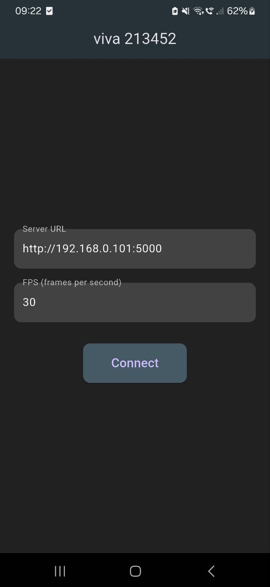

# With the help of this application, you can control a PC (on which the server is running) from a phone connected to the same Wi-Fi network.

The compilation is set up only for Android.

To start, you need to run the server on the PC you want to control, and enter the IP address and port into the app on your phone.

### Run
```
flutter build apk --release
cd server
pyinstaller main.pyw
```


